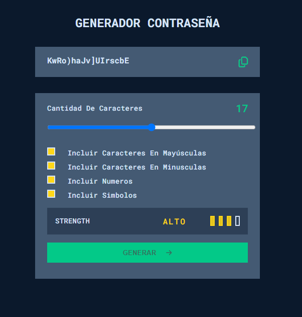

# Introduccion a JavaScript

En este repositorio se iran subiendo las actividades realizadas en DEV.F del programa de Becalos.

## Clase 1. Introduccion a JavaScript

En esta clase se dio un acercamiento a java script. Se vieron los diferentes tipo de variables principales y aplicar buenas practicas.
En la carpeta de [Clase-01](https://github.com/MLuisaGP/Becalos-Introduccion-JavaScript/tree/main/Clase-01)
Se tienen tres archivos:
- [Index.html](https://github.com/MLuisaGP/Becalos-Introduccion-JavaScript/blob/main/Clase-01/index.html) Este archivo esta solo para ver como importar el archivo .js desde html

- [main.js](https://github.com/MLuisaGP/Becalos-Introduccion-JavaScript/blob/main/Clase-01/main.js) Archivo que se realizo durante la clase en vivo. Aqui se provaron los diferentes tipos de variables primitivas y algunas de las compuestas. Se hicieron diferentes pruebas para ver como reacionaban y como funcionaba, dando uso de console.log() para imprimir en consola la inf y type of para obtener que tipo de variable son. 

      // Respuesta de main.js
      Hola Mundo
      object
      object
      { nombre: 'Ivan', edad: 23, nacionalidad: 'Mexicana' }
      23
      object
      [ 1, 2, 3, 4, 5 ]
      4
      function
      [Function: suma]
      13
      object
      2025-02-05T02:46:32.228Z
  
- [tipos-de-dato.js](https://github.com/MLuisaGP/Becalos-Introduccion-JavaScript/blob/main/Clase-01/tipos-de-dato.js) Finalmente este archivo es la actividad solicitada para esta clase, el cual consiste en obtener que tipo de variable son los diferentes valores definidos.  

      // Respuesta de tipos-de-dato.js
      number
      string
      number
      boolean
      number
      string
      object
      undefined
      undefined
      boolean
      false

## Clase 2. Comparaciones y decisiones en JavaScript

En esta clase se vieron los diferentes operadores simples, comparacion y los logicos. Se dio una vista al uso de arrays. Asi mismo se comenzo a utilizar la estructura de control If, realizando diferentes actividades para su entendimiento.

En la carpeta de [Clase-02](https://github.com/MLuisaGP/Becalos-Introduccion-JavaScript/tree/main/Clase-02)
se tienen cinco archivos:
- [activity-ext.js](https://github.com/MLuisaGP/Becalos-Introduccion-JavaScript/blob/main/Clase-02/activity-ext.js) El cual contiene tres diferentes ejercicios realizados en clases, utilizando la estructura de control if. Las actividades realizadas fueron:
  - Numeros pares e impares: Se hizo uso de numero aleatorios y operador ternario.
  - Numeros primos y compuestos: se hizo uso de numeros aleatorios y se comenzo a utilizar el ciclo for.
  - Estación en que nos encontramos: se utilizo la estructura control if y el uso del objeto Date.

 La respuesta dada por este ejercicio fue el siguiente.

     El numero 8 es par y es compuesto
     Estamos en invierno.

- [control-if.js](https://github.com/MLuisaGP/Becalos-Introduccion-JavaScript/blob/main/Clase-02/control-if.js) En este archivo se tienen notas del uso del control if y diferentes formas de utilizarlo. 

- [control-switch.js](https://github.com/MLuisaGP/Becalos-Introduccion-JavaScript/blob/main/Clase-02/control-switch.js) En este archivo se tienen notas del uso del switch. 

- [practice_2.js](https://github.com/MLuisaGP/Becalos-Introduccion-JavaScript/blob/main/Clase-02/practice_2.js) En este archivo se tiene la actividad de practica. Es el archivo más importante ya que muestra la actividad solicitada por Dev.F. Este cuenta con una logica donde se muestra un mensaje personalizado segun una calificacion. La calificacion se creo de forma aleatoria y se hizo uso de variables, constantes y estructrua if.
La respuesta se puede ver a continuación:

      Tu nota fue 62. Suficiente para pasar

- [type.js](https://github.com/MLuisaGP/Becalos-Introduccion-JavaScript/blob/main/Clase-02/type.js) Finalmente tenemos el archivo type.js. En este archivo se tienen las notas realizadas en clase, donde se ve como almacenar las variables, realizar concatenación (permitiendo obtener diferentes formas de imprimir el resutado), uso de arrays, uso de los diferentes tipos de operadores ( basicos, logicos y de comparación) y tambien se muestra como generar un numero aleatorio, como se muestra a continuación, :

      //Numeros aleatorios
      let numeroAleatorio = Math.floor(Math.random()*101); //Math.floor- redondea al numero hacia abajo.Se genera un numero entre 0 y 100

## Clase 3. Arreglos y ciclos en JavaScript

En esta clase se vio de fondo sobre los arreglos y los ciclos mas comunes en javascript.

En la carpeta de [Clase-03](https://github.com/MLuisaGP/Becalos-Introduccion-JavaScript/tree/main/Clase-03)
se tienen cuatro archivos:
- [ejercicio.js](https://github.com/MLuisaGP/Becalos-Introduccion-JavaScript/blob/main/Clase-03/ejercicio.js) Se realizan diferentes ejercicios con el proposito de reforzar lo aprendido dando uso de arreglos y ciclos en diferentes situaciones:
  - Realizar una tabla de multiplicar, se ingresa un numero y se imprmie la multiplicacion de ese numero hasta el numero 10.
  - Contador de digitos, se manda un numero con varios digitos por consola e imprime la cantidad de digitos que posee ese numero.
  - Con el mismo numero ingresado en el ejercicio anterior, se obtiene el total de la suma de cada uno de los digitos.
  - Obtener el numero mayor dentro de un array, se manda un array con diferentes numeros y se va revisando cada uno de ellos, guardando en una variable el digito mayor, se inicia teniendo en la variable como valor 0 y se va comparando con el siguiente digito, si el siguiente digito es mayor entonces este procige a ser almacenado en la variable.
  
  Para este ejercicio es necesario correrlo desde [index.html](https://github.com/MLuisaGP/Becalos-Introduccion-JavaScript/blob/main/Clase-03/index.html), ya que se introduccen los datos desde promt

- [frutas.js](https://github.com/MLuisaGP/Becalos-Introduccion-JavaScript/blob/main/Clase-03/frutas.js) En este archivo contienen la practica de la clase. Se clasifican frutas en 5 tipos diferentes: acidas, semiacidas, neutras, dulces y otros. Se envia un arreglo con diferentes frutas, y se va procesando ese arreglo donde en se va aumentando el numero de frutas segun su tipo en un objeto clasificador.

      //ARRAY FRUTAS:
      let frutas = [
      "kiwi", "limon", "naranja", "uva", "arandanos",
      "fresa", "mango", "mandarina", "ciruela", "nispero",
      "coco", "aguacate", "almendra", "nuez", "cacahuate",
      "platanos", "cereza", "higo", "sandia", "granada","piña",
      "pitaya"];

      //RESPUESTA:
      { acidas: 6, semiacidas: 5, neutras: 5, dulces: 5, otro: 1 }

- [index.html](https://github.com/MLuisaGP/Becalos-Introduccion-JavaScript/blob/main/Clase-03/index.html) Archivo de indice de la carpeta, con este archivo html se puede correr para ejecutar el archivo.[ejercicio.js](https://github.com/MLuisaGP/Becalos-Introduccion-JavaScript/blob/main/Clase-03/ejercicio.js)

- [note-class.js](https://github.com/MLuisaGP/Becalos-Introduccion-JavaScript/blob/main/Clase-03/note-class.js) Archivo donde se almacena las notas realizadas en clases. Aqui se ven anotaciones referentes a arrays y los diferentes ciclos.

## Clase 4. Funciones en JavaScript

En esta clase de vio los conceptos básicos de funciones, viendo los diferentes tipos de funciones y la forma de utilizarlos.

En la carpeta [Clase-04](https://github.com/MLuisaGP/Becalos-Introduccion-JavaScript/tree/main/Clase-04)
se tienen seis archivos:
- [anonimos.js](https://github.com/MLuisaGP/Becalos-Introduccion-JavaScript/blob/main/Clase-04/anonimos.js) En este archivo se tienen las anotaciones de como y donde utilizar una funcion anonima. Aqui hay una introduccion a los callbacks.

- [arrows.js](https://github.com/MLuisaGP/Becalos-Introduccion-JavaScript/blob/main/Clase-04/arrows.js) Archivo donde se tiene ejemplo de la funciones flechas. Tambien se tienen anotaciones sobre la diferencia entre las variables declaradas con let y var. Las variables declaradas con let mantienen una mayor seguridad, mientras que las variables var no son recomendadas de usar ya que estas pueden ser declaradas mas de una vez con el mismo nombre o en cualquier parte del codigo se pueden llamar.

- [ejercicio.js](https://github.com/MLuisaGP/Becalos-Introduccion-JavaScript/blob/main/Clase-04/ejercicio.js) Ejercicios realizados al final de la clase 4 con el proposito de reforzar lo aprendido. Las actividades realizadas fueron las siguientes:
   - Varificador de palindromo. Se utiliza una funcion que recorre una lista de palabras y va verificando se la palabra es palindromo o no.
   - Numeros mayores de un numero. Se manda un numero que se desea que a partir de este se guarden numeros mayores. A continuacion se puede apreciar el codigo del ejercicio.

         // Filtrar los numeros mayores de un numero
         function filtrarMayor(numeroBase){
         let numerosMayores=[]
         for (let i = 0; i < 10; i++) {
               let numero = Math.floor(Math.random()*101); 
               if(numeroBase<numero)numerosMayores.push(numero);
         }
         return numerosMayores;
         }         
         let lista = filtrarMayor(45);
         console.log(lista);
  
  - Obtener el area de un circulo. Para este ejercicio se hizo uso de una funcion flecha.
  - Ecuaciones metematicas. Se hace uso de una funcion con paramteros defaults.

- [funciones.js](https://github.com/MLuisaGP/Becalos-Introduccion-JavaScript/blob/main/Clase-04/funciones.js) Archivo que contiene las formas basicas de crear una funcion con y sin parametros. Tambien se tiene la forma en como llamar una funcion.

- [index.html](https://github.com/MLuisaGP/Becalos-Introduccion-JavaScript/blob/main/Clase-04/index.html) Este archivo index.html, cuenta con dos botones uno para agregar libros y otro para ver los libros. Este archivo esta con el proposito de agregar un plus extra a la practica de la clase 4, donde al dar click en el boton de agregar libro, el usuario puede ingresar el nombre de un libro que ya ha leido y este se almacenara en una variable global. Y si desea ver los libros que se tienen almacenados basta con darle click en ver libros y estos se mostraran en consola.

- [libros.js](https://github.com/MLuisaGP/Becalos-Introduccion-JavaScript/blob/main/Clase-04/libros.js) Archivo que contiene la practica de la clase 4. El proposito es utilizar las funciones aprendidas en clase y el uso de variables globales. Se tiene una variable con el nombre librosLeidos, en esta se almacenan los libros leidos almacenados por el usuario ( Esta seria una variable global). Se crean dos funciones:
  - agregarLibro: funcion flecha que agrega un libro al array libros leidos y tiene un parametro con el nombre libro, parametro que sera ingresado por el usuario y sera almacenada en el arreglo.
  - mostrarLibrosLeidos: funcion flecha que muestra en consola los libros leidos e insertados por el usuario.

## Clase 5. Intro a Objects en JavaScript

En esta clase se da introduccion al uso de objetos, clases y metodos.

En la carpeta [Clase-05](https://github.com/MLuisaGP/Becalos-Introduccion-JavaScript/tree/main/Clase-05)
se tienen dos archivos:
- [Objetos.js](https://github.com/MLuisaGP/Becalos-Introduccion-JavaScript/blob/main/Clase-05/Objetos.js) Archivo realizado en clases. En este archivo se hace anotaciones a las diferentes formas de crear objetos, el uso de clases y de metodos. Se puede ver las ventajas de crear una clase, el cual es el model de los objetos haciendo que una clase nazcan varios objetos de ella. Asi mismo se vio las ventajas de los objetos y como nos permite tener esa flexibilidad de crear distinsta cosas.

- [Practica5.js](https://github.com/MLuisaGP/Becalos-Introduccion-JavaScript/blob/main/Clase-05/Practica5.js) En la practica 5 se hace uso de una clase Libros que permite crear diferentes instancias de libros con la información basica de ellos como titulo, autor, anio, estado. Se da uso de metodos para mostrar los datos del libro como diferentes metodos con y sin parametros con el objetivo de agregar capitulo, eliminar capitulos y mostrar los capitulos que poseia cada libro. Gracias a que se implemento la parte de capitulos, se pudo ver como una propiedad de libros puede ser una lista de mas objetos, en este caso los objetos fueron los capitulos.
El resultado dado en esta actividad la podemos ver acontinuación:

      'En auschwitz no habia prozac' escrito por: Edith Edger publicado en el 2020, se ecuentra Disponible
      [
            { titulo: '¿Y ahora qué?', noPaginas: 17 },
            { titulo: 'Nadie te rechaza excepto tú', noPaginas: 10 }
      ]

## Clase 6. Intro al DOM en Java Script

En esta clase se da introduccion al DOm en javascript. El DOM (Document Object Model) en JavaScript es una representación estructurada de un documento HTML o XML. Funciona como una interfaz que permite a JavaScript acceder y manipular el contenido, la estructura y el estilo de una página web. A través del DOM, los desarrolladores pueden modificar elementos, agregar o eliminar nodos, cambiar estilos y responder a eventos en tiempo real, haciendo que las páginas web sean dinámicas e interactivas.

En la carpeta [Clase-06](https://github.com/MLuisaGP/Becalos-Introduccion-JavaScript/tree/main/Clase-06)
se encuentran varias carpetas conteniendo los diferentes ejercicios realizados en clase y la practica final de la clase, en esta ocasion se encuentran separadas en carpetas ya que se tienen el html junto con js que estan vinculados.
- [EjercicioClase](https://github.com/MLuisaGP/Becalos-Introduccion-JavaScript/blob/main/Clase-06/EjercicioClase) 
Notas y ejercicios realizados en clase, donde se realizan actividades utilizando el DOM. Se comienza a ver como se crean elementos y se agregan a otros, como funciona los nodos, eliminar elementos y la integracion de eventos y callbacks.
- [ejercicioLectura](https://github.com/MLuisaGP/Becalos-Introduccion-JavaScript/blob/main/Clase-06/ejercicioLectura)
Estos son los ejercicios expuestos en la lecturas de esta clase, se integran los ejercicios que solicita las lecturas hacer junto con las soluciones, aqui el script se realizo de forma interna en el html sin la necesidad de crear otro archivo .js con el proposito de ver como se programaria js desde el mismo html.
- [EjerciciosExtras](https://github.com/MLuisaGP/Becalos-Introduccion-JavaScript/blob/main/Clase-06/EjerciciosExtras)
Ejercicios extras realizados en clase. Consiste en tres retos:
  1.  Con un boton cambiar el color del texto cada vez que se hace click.
  2.  Crear un boton que permita ocultar y mostrar un parrado. El boton cambia de texto dependiendo si el texto se esta mostrando o ocultado.
  3.  Crear un contador de clicks, este contador de click se tiene un boton donde cuenta cada vez que le hacen click

- [Practica](https://github.com/MLuisaGP/Becalos-Introduccion-JavaScript/blob/main/Clase-06/Practica) Finalmente se tiene la practica de la clase. La practica consiste en hacer un centro de comentarios. El usuario agrega un comentario el cual se muestra en la pagina junto con el nombre de quien lo comentar y la fecha en que se comento. Estos comentarios se pueden eliminar. Tambien se agregaron boones para darle me gusta a la imagen (si vuelven a darle click al boton se elimina el me gusta que se acaba de agregar) y otro boton para compartir la imagen. Este ejercicio se baso en el sistema que utiliza facebook para comentar una imagen. El resultado final se puede ver en la imagen que se muestra a continuacion.
  

## Clase 7. Dominando el DOM en JavaScript

En esta clase se siguio viendo las manera de manipular el DOM en JavaScript, por lo que fue más practico los ejercicio. Se realizo como proyecto para fortalecimiento de conocimientos un generador de contraseñas, proyecto que ayudo a fortalecer los conocimientos adquiridos, el proyecto se encuentra en el siguiente link [Generador de contraseñas](https://github.com/MLuisaGP/Becalos-Introduccion-JavaScript/tree/main/Generador_pwd). En esta carpeta se tiene el html, css y main del proyecto. A continuación una visualizacion de el:

Cabe mencionar que el diseño de este proyecto fue inspirado por el generador de contraseñas de [Frontend Mentor](https://www.frontendmentor.io/challenges/password-generator-app-Mr8CLycqjh)
## Autor

Creado por [MluisaGP](https://github.com/MLuisaGP)

